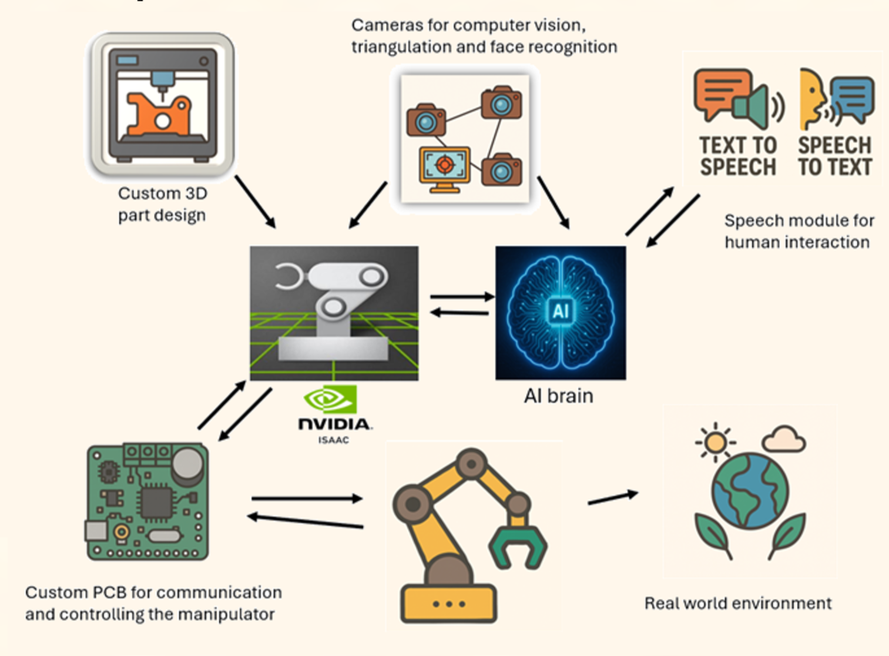

# AGI

## Проектът:
Роботизиран асистент, състоящ се от механизирани ръце, които взаимодействат със околната му среда. Използва камери, за да разбира средата му по-добре и взима решения с изкуствен интелект. Можеш свободно да говориш с него, а и той ще те познае ;)

## Блок схема:

---

Това е проектът AGI, създаден от ученици от 11 клас в ТУЕС.
Разпределение:
- Антон Христов 11б -  Simulation
- Михаил Георгиев 11б - Computer Vision
- Ясен Цветков 11б - Embedded
- Светослав Илиев 11в - AI
- Никола Алексов 11г - 3D Design

*Всяка част от проекта е отделена в свое репо под организацията*
